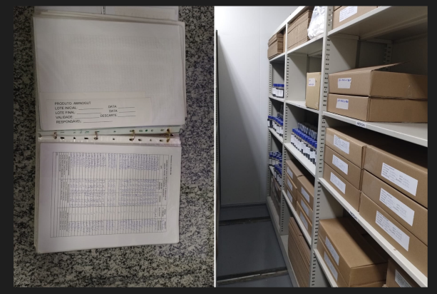
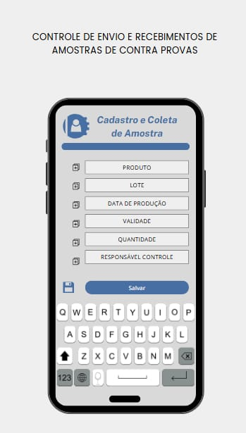
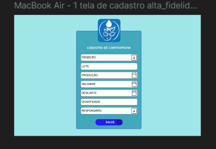
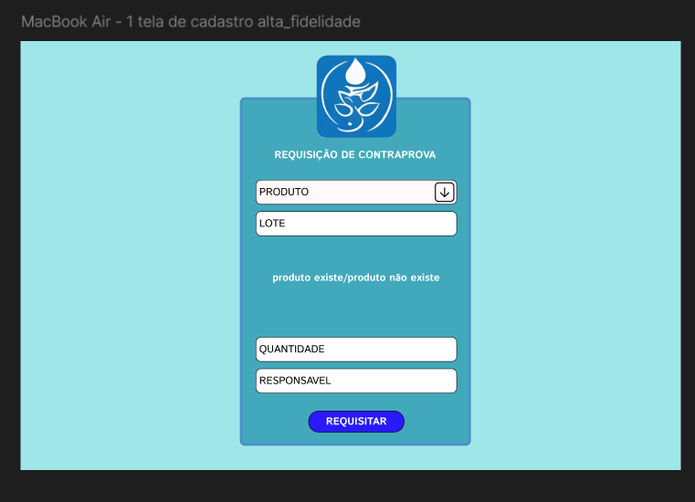
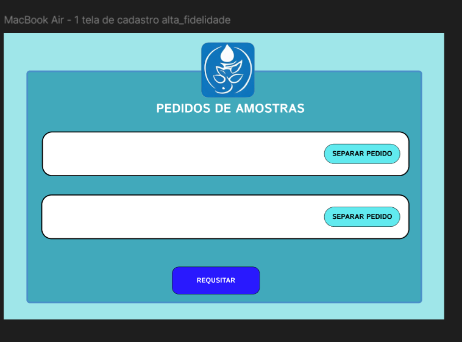

### Documentação Completa do Sistema de Gestão de Contraprovas

---

#### **1. Descrição dos Problemas e Seus Impactos no Setor de Contraprovas**

O setor de contraprovas desempenha um papel crucial no controle de qualidade de produtos, garantindo que amostras estejam disponíveis para futuras verificações e para atender aos requisitos de conformidade. Contudo, a gestão atual enfrenta vários problemas devido ao uso excessivo de registros físicos e à dependência de controles manuais, o que prejudica a eficiência e a segurança das operações. Abaixo, detalhamos os principais problemas e seus impactos:

##### **1.1. Excesso de Registros em Papel e Espaço Ocupado**
- **Impacto no Espaço Físico**: O uso extensivo de documentos em papel ocupa um espaço significativo no setor, prejudicando a organização e limitando a capacidade de armazenar adequadamente as amostras.
- **Dificuldade de Acesso a Informações**: A consulta manual aos registros é demorada e complexa, o que resulta em atrasos durante auditorias e inspeções.

##### **1.2. Tempo Excessivo Gasto no Registro Manual**
- **Impacto na Produtividade**: Preencher registros manualmente consome tempo dos colaboradores, reduzindo a produtividade e deixando de dedicar atenção ao monitoramento das amostras.
- **Risco de Erros Humanos**: A dependência de registros manuais aumenta as chances de erros, comprometendo a rastreabilidade e a confiabilidade dos dados.

##### **1.3. Dificuldade em Rastrear e Recuperar Informações de Contraprovas**
- **Problemas na Rastreabilidade**: A dificuldade em rastrear informações essenciais como lotes e datas de fabricação coloca em risco a capacidade de responder adequadamente às exigências de qualidade e conformidade.
- **Ineficiência nas Auditorias e Inspeções**: A recuperação manual de informações torna o processo de auditoria e inspeção moroso e suscetível a falhas.

##### **1.4. Risco de Deterioração e Perda de Registros Físicos**
- **Vulnerabilidade dos Dados**: Documentos físicos estão sujeitos a danos, extravios ou destruição acidental, o que compromete a continuidade do controle de qualidade e pode resultar em não conformidade com regulamentações.
  
##### **1.5. Uso Ineficiente dos Recursos de Trabalho**
- **Impacto no Custo Operacional**: O uso de recursos materiais, como papel e espaço físico, eleva os custos operacionais e diminui a eficiência do setor.
- **Redução na Agilidade de Processos**: A dependência de registros manuais e físicos reduz a capacidade de resposta do setor e gera atrasos nas atividades diárias.

---

---

#### **2. Proposta de Solução: Sistema Digital de Gestão de Contraprovas**

Para resolver os problemas identificados, propomos a implementação de um sistema digital de gestão de contraprovas, com as seguintes funcionalidades e benefícios:

##### **2.1. Objetivo da Aplicação**
A aplicação visa eliminar os registros físicos e a gestão manual de contraprovas, oferecendo uma plataforma digital que centraliza o cadastro e a consulta das amostras, além de automatizar tarefas, melhorar a rastreabilidade e garantir a segurança dos dados.

##### **2.2. Funcionalidades Propostas**

1. **Cadastro Digital de Amostras**:
   - Registro das amostras com dados como nome do produto, lote, data de fabricação, data de vencimento, quantidade e responsável.
   - Capacidade de editar ou excluir amostras conforme necessário.

2. **Rastreabilidade e Consulta Rápida**:
   - Sistema de busca eficiente para localizar amostras por critérios como lote, data ou produto.
   - Geração de relatórios para auditorias e inspeções, facilitando a recuperação de dados com rapidez e precisão.

3. **Automatização de Tarefas e Notificações**:
   - Alertas automáticos para vencimento de amostras ou necessidade de descarte.
   - Registro automático de movimentações e atualizações de amostras.

4. **Segurança e Backup de Dados**:
   - Armazenamento seguro e backup de dados, garantindo a proteção contra perdas acidentais.
   - Controle de acesso para assegurar que apenas usuários autorizados possam editar informações.

5. **Monitoramento de Produtividade**:
   - Ferramentas de análise para monitorar o tempo de execução de tarefas e a frequência de consultas, permitindo melhorias contínuas.

6. **Digitalização de Documentos**:
   - Possibilidade de anexar documentos digitais às amostras, eliminando a necessidade de registros físicos.

##### **2.3. Benefícios Esperados**
- **Redução de Custos Operacionais**: Ao eliminar o uso de registros físicos e automação de tarefas, o sistema reduz significativamente os custos com recursos materiais e tempo de trabalho.
- **Maior Eficiência e Agilidade**: O acesso digital facilita a consulta de dados, melhora a rastreabilidade e acelera a resposta a auditorias e inspeções.
- **Segurança de Dados**: Com backup e controle de acesso, os dados estarão mais seguros e protegidos contra perdas ou danos físicos.
- **Melhoria na Conformidade**: O sistema garante que as amostras e informações estejam sempre acessíveis, auditáveis e em conformidade com as regulamentações.

---

#### **3. Ferramentas e Tecnologias a Serem Utilizadas**

Para implementar a solução proposta, as seguintes tecnologias e ferramentas serão utilizadas:

##### **3.1. Frontend**
- **React**: Biblioteca JavaScript para construção da interface de usuário, permitindo uma aplicação dinâmica e interativa.
- **React Router**: Para gerenciar a navegação entre as páginas da aplicação de forma simples e eficiente.
- **Axios ou Fetch API**: Ferramentas para realizar requisições HTTP, conectando o frontend com o backend.
- **Redux ou Context API**: Para o gerenciamento de estado global da aplicação, útil quando há compartilhamento de dados entre múltiplos componentes.

##### **3.2. Backend**
- **Node.js com Express**: Framework de backend para construir a API RESTful que se comunicará com o frontend.
- **Banco de Dados**:
  - **MongoDB** (NoSQL) ou **PostgreSQL/MySQL** (SQL): Para o armazenamento das informações das amostras de forma estruturada e segura.
- **Autenticação**:
  - **JWT (JSON Web Tokens)**: Para autenticação e controle de acesso seguro à aplicação.

##### **3.3. Infraestrutura e Hospedagem**
- **Docker**: Para criar contêineres e facilitar a portabilidade do ambiente de desenvolvimento e produção.
- **Heroku / AWS / DigitalOcean**: Para hospedagem da aplicação e banco de dados.
- **Git e GitHub/GitLab**: Para versionamento de código, colaboração e controle de versões.

##### **3.4. Outras Ferramentas**
- **Figma ou Adobe XD**: Para criação de wireframes e protótipos, facilitando a visualização da interface antes do desenvolvimento.
- **Swagger**: Para documentar a API de forma interativa e facilitar a comunicação entre equipes de desenvolvimento.
- **Jest ou React Testing Library**: Ferramentas para testes unitários e de integração, garantindo a qualidade do código.

---

##### **PROTOTIPOS**

#### *PROTOTIPO PARA CELULAR*

#### *PROTOTIPO PARA PC*

